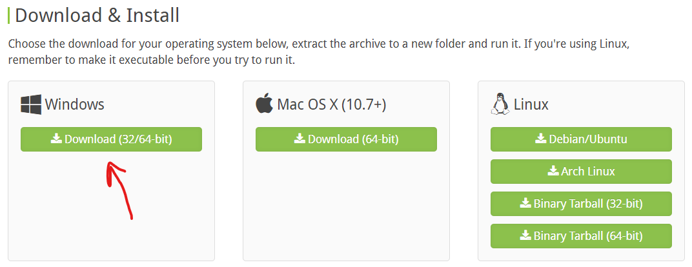
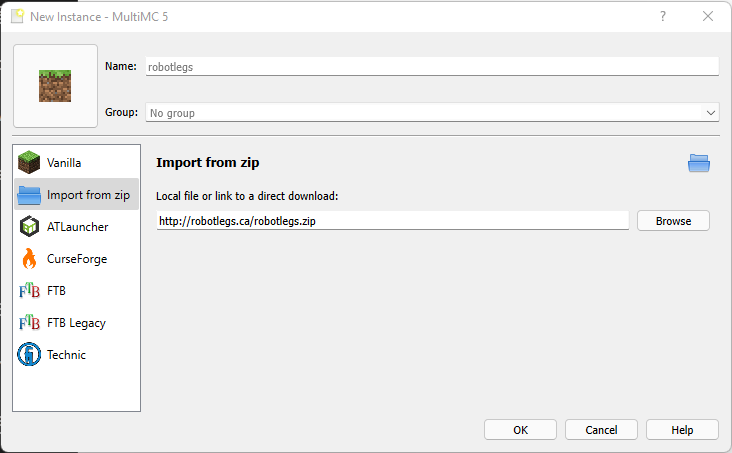
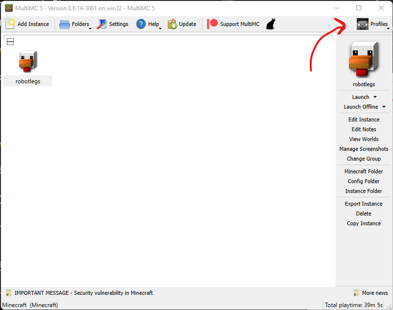

# Robotlegs.ca Minecraft Server 2022
Minecraft server for friends and family. Using the Better Minecraft modpack.

---

## **Windows Installation**

### Requirements
- Java 17 or higher
- MultiMC
- Shader pack (optional) 
---
### **Java 17**

1. Download Java. Goto https://www.azul.com/downloads/?version=java-17-lts&os=windows&architecture=x86-64-bit&package=jdk.
2. Scroll down and find **Windows x86 64-bit**. Download the **.msi**

3. Run **the .msi file** to install Java 17.
---
### **MultiMC**

1. Download MultiMC. Goto https://multimc.org/.
2. Scroll down and download for Windows.

3. Extract the **MultiMC** folder from the zip file.
4. Run **MultiMC.exe** from inside the folder.
---
## Usage
### MultiMC & Minecraft Setup

---
**Select language**

---
**Select Java version 17+**

- Increase memory allocation. Set Maximum to atleast 4096 MiB (4GB), the more the better.

- Choose to enable analytics or not.

---
**Main screen**

- Click "Add Instance"

- Select "CurseForge" on the left
- Scroll the list to the right untill you find "Better Minecraft [FABRIC] - 1.18.1"
- Click "OK"
- MultiMC will download and install all of the Mods.

---
**Add Minecraft Account**

- Click "Profiles" in the top right of the main screen.
- Select "Manage Accounts"
- On the right select "Add Microsoft" or "Add Mojang" to login to your minecraft Account.
- After you login close the setting screen.

---
**Run Minecraft**

- Either double-click the "Better Minecraft" instance or select "Launch" on the right.
- The first time you load the game it will take longer.

- On the main menu select "Multiplayer"
- Click "Add Server"

- For "Server Address" input `robotlegs.ca`

- Press "Done".

- Your server list should look like this.

- The first time you login to the server it should say you are not on the whitelist. Once you see this message let Photon know you need to be whitelisted.

**That's it! Enjoy!**

---
## Shaders
### Before and After

### Shader Installation

1. Download Complementary Shaders from https://www.curseforge.com/minecraft/customization/complementary-shaders. (Click "Download" at top right of page)
2. In MultiMC select the "Better Minecraft" instance. Select "Edit Instance on the right.
3. Select "Shader packs" on the left.

4. Click "Add" in the top right
5. Select "ComplementaryShaders_v4.3.3.zip" from your Downloads folder.
6. Click "Close".
7. Launch Minecraft.
8. Login to the server.
9. Press Esc
    - Select "Options..."
    - Select "Video Settings..."
    - Select "Shader Packs..."
    - Select "ComplementaryShaders_v4.3.3.zip" from the list
    - Click "Apply" at the bottom.
10. Close settings screens.
11. You can now use the "K" button to turn shaders on or off.

---
## More Resources

- Better Minecraft 1.81.1 Modlist https://www.curseforge.com/minecraft/modpacks/better-minecraft-modpack-new/relations/dependencies